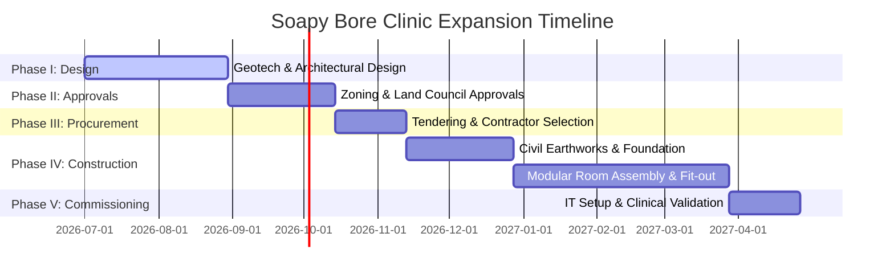

# UHSAC Project Plan: Soapy Bore Clinic Expansion

## 1. Project Overview
* **Project Name**: Soapy Bore Central Clinic Infrastructure Expansion
* **Location**: UHSAC Central Clinic, Amengernterne (Soapy Bore), Utopia NT
* **Project Manager**: Marcus Deluis (Infrastructure Coordinator)
* **Clinical Advisor**: Dr. David Boyle (Clinical Director)
* **Estimated Timeline**: 12 Months (Commencing July 2026)
* **Total Estimated Budget**: $1,250,000.00

---

## 2. Background and Objectives
The central clinic at Soapy Bore is the primary healthcare hub for 16 outstations. Currently, the clinic has only three small consultation rooms, which limits the concurrent scheduling of visiting allied health, GPs, and specialized programs (e.g. Birthing on Country and Cancer Screening). 

This expansion project will construct a new modular extension to the clinic building.

### Project Objectives:
1. Construct 3 new consulting rooms, including a dedicated maternal health/birthing room.
2. Build a private mental health counseling space to support the Social and Emotional Wellbeing (SEWB) program.
3. Install a clean air ventilation system (positive pressure) to reduce dust and cross-infection risks.
4. Establish local First Nations employment, aiming for 30% local subcontractor labour hours.

---

## 3. Project Phases & Timelines

### Phase Details:
* **Phase I: Planning & Architectural Design (Months 1-2)**: Complete structural engineering drawings, geotech soil testing, and positive-pressure ventilation specs.
* **Phase II: Approvals & Permissions (Months 3-4)**: Secure building clearance certificates and Central Land Council (CLC) site permits.
* **Phase III: Procurement & Tendering (Month 5)**: Tender for prefabricated structural modular units and local civil contractors.
* **Phase IV: Site Construction (Months 6-10)**: Clear site, pour concrete foundations, install structural modules, connect electrical/plumbing, and perform fit-out.
* **Phase V: Medical Commissioning (Months 11-12)**: Sterilize spaces, install clinical equipment, connect telehealth networks, and secure NT Health licensing.

---

## 4. Resource Allocation & Budget Details

| Cost Category | Description | Budget (AUD) |
|---|---|---|
| Consulting & Permits | Geotech, architectural, CLC clearances, and permits | $80,000 |
| Ground Works | Site clearing, excavation, and concrete slab pouring | $120,000 |
| Prefab Modules | 4x clinical-grade prefabricated consulting modules | $650,000 |
| Electrical & Plumbing | Mains integration, backup generator links, positive pressure HVAC | $180,000 |
| Medical Fit-out | Examination tables, lighting, clinical computers, instruments | $120,000 |
| Contingency | 8% reserve for remote freight cost variations | $100,000 |
| **Total Project Budget** | | **$1,250,000** |
